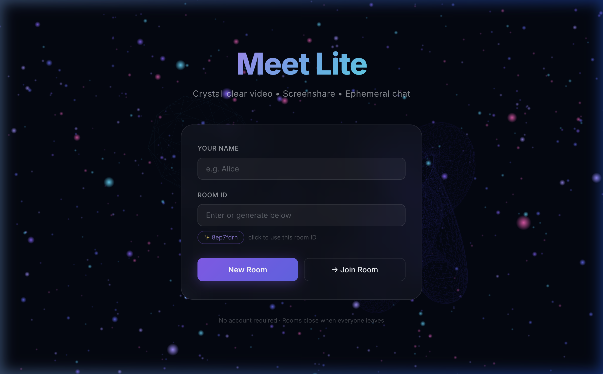

# Meet Lite 

Meet Lite is a lightweight, modern group video calling application featuring crystal-clear video, screen sharing, and ephemeral chat. Designed with a premium dark glassmorphism UI and a stunning 3D interactive background.

No account required — rooms close when everyone leaves.



## ✨ Features

- **High-Quality Video & Audio**: Powered by [LiveKit](https://livekit.io/).
- **Screen Sharing**: Easily share your screen with the room.
- **Ephemeral Chat**: Real-time room chat using [Socket.IO](https://socket.io/). Messages disappear when the room closes.
- **Stunning UI**: 
  - Interactive **Three.js** particle & wireframe background with mouse parallax.
  - Premium dark mode with **Glassmorphism** cards and components.
  - Smooth micro-animations, gradient text, and clean typography (Inter font).
- **Frictionless Entry**: Generate a random room ID or type your own. Share the link, and others can join instantly.

---

## 🛠️ Tech Stack

### Client (Frontend)
- **Framework**: React 19 + TypeScript + Vite
- **Styling**: Vanilla CSS (CSS Variables, Glassmorphism, Keyframes)
- **3D Graphics**: Three.js (Custom particle systems and geometries)
- **RTC/Media**: `@livekit/components-react`, `livekit-client`
- **Networking**: `socket.io-client`
- **Routing**: `react-router-dom`

### Server (Backend)
- **Runtime**: Node.js + TypeScript
- **Framework**: Express.js
- **RTC/Media Management**: `livekit-server-sdk` (Generates secure tokens for clients)
- **Real-time Signaling/Chat**: `socket.io`

---

## 🚀 Getting Started

### Prerequisites
1. **Node.js** (v18 or higher)
2. A **LiveKit Server** instance. You can run one locally via Docker, or use LiveKit Cloud.

### 1. Server Setup
Navigate to the `server` directory and install dependencies:
```bash
cd server
npm install
```

Create a `.env` file in the `server` directory with your LiveKit credentials:
```env
LIVEKIT_API_KEY=your_api_key
LIVEKIT_API_SECRET=your_api_secret
LIVEKIT_URL=wss://your-livekit-server.livekit.cloud
PORT=4000
```

Start the development server:
```bash
npm run dev
```
*The server will run on `http://localhost:4000`.*

### 2. Client Setup
Open a new terminal tab, navigate to the `client` directory, and install dependencies:
```bash
cd client
npm install
```

Create a `.env` file in the `client` directory:
```env
VITE_SERVER_URL=http://localhost:4000
```

Start the Vite development server:
```bash
npm run dev
```
*The frontend will run on `http://localhost:5173`.*

---

## 📁 Project Structure

```text
meet-lite/
├── client/                 # React Frontend
│   ├── src/
│   │   ├── components/     # Reusable UI (e.g., ThreeBackground.tsx)
│   │   ├── pages/          # Route components (Home.tsx, Room.tsx)
│   │   ├── App.tsx         # Routing setup
│   │   └── index.css       # Global design system & theme variables
│   └── package.json
└── server/                 # Express Backend
    ├── src/
    │   └── index.ts        # Express API, LiveKit token generation, Socket.IO hub
    ├── .env                # LiveKit secrets
    └── package.json
```

